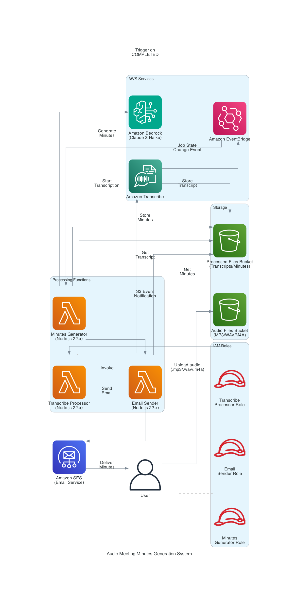

※本コードは#cdkvibecodingfesの提出用のコードです。
フルVibe Codingで書いているため、最低限の動作確認のみを行なっています。
READMEに関しても、次の行からは全て生成AIによるものです。

# 音声議事録自動生成システム

S3に音声ファイルをアップロードするだけで、自動的に文字起こし→議事録生成→メール送信を行うサーバーレスシステムです。

## 🎯 システム概要

音声ファイル（会議録音など）を指定のS3バケットにアップロードすると、以下の処理が自動実行されます：

1. **文字起こし**: Amazon Transcribeによる音声→テキスト変換
2. **議事録生成**: Amazon Bedrockを使用したAI議事録作成
3. **メール送信**: 生成された議事録をメールで関係者に配信

## 🏗️ アーキテクチャ



```
[ユーザー] → [S3] → [Lambda] → [Transcribe] → [EventBridge]
                                                      ↓
[メール受信者] ← [SES] ← [Lambda] ← [Bedrock] ← [Lambda]
```

### 主要コンポーネント

- **S3 Buckets**: 音声ファイル保存・処理結果保存
- **Lambda Functions**: 
  - TranscribeProcessor: 音声処理開始
  - MinutesGenerator: 議事録生成
  - EmailSender: メール送信
- **Amazon Transcribe**: 音声文字起こし（話者分離対応）
- **Amazon Bedrock**: Claude-3 Haikuによる議事録生成
- **Amazon SES**: メール配信
- **EventBridge**: Transcribe完了イベント管理

## 🚀 セットアップ

### 前提条件

- Node.js 22.x
- AWS CLI設定済み
- AWS CDK v2インストール済み

### 1. プロジェクトセットアップ

```bash
git clone <repository-url>
cd cdkvibecodingfes
npm install
```

### 2. メール設定

`cdk.json`でメール設定を変更：

```json
{
  "fromEmail": "your-sender@example.com",
  "toEmails": "recipient1@example.com,recipient2@example.com"
}
```

### 3. SESメールアドレス認証

```bash
# 送信者メールアドレス認証
aws ses verify-email-identity --email-address your-sender@example.com

# 受信者メールアドレス認証
aws ses verify-email-identity --email-address recipient1@example.com
aws ses verify-email-identity --email-address recipient2@example.com
```

各メールアドレスに認証メールが届くので、リンクをクリックして認証を完了してください。

### 4. デプロイ

```bash
# ビルド
npm run build

# テスト実行
npm test

# デプロイ
cdk deploy
```

## 📝 使用方法

### 音声ファイルアップロード

デプロイ完了後、出力されるS3バケット名に音声ファイルをアップロードします：

```bash
aws s3 cp your-audio-file.wav s3://audio-files-bucket-{account-id}/
```

### 対応音声形式

- `.wav`
- `.mp3`
- `.m4a`

### 処理フロー

1. **アップロード**: 音声ファイルをS3にアップロード
2. **文字起こし**: 自動的にTranscribeが開始（数分程度）
3. **議事録生成**: 文字起こし完了後、Bedrockで議事録を生成
4. **メール送信**: 議事録が完成したらメールで通知

## ⚙️ 設定オプション

### コマンドライン引数でのメール設定

```bash
cdk deploy \
  -c fromEmail=sender@example.com \
  -c toEmails=user1@example.com,user2@example.com
```

### 環境変数

各Lambda関数では以下の環境変数が利用可能：

- `FROM_EMAIL`: 送信者メールアドレス
- `TO_EMAILS`: 受信者メールアドレス（カンマ区切り）
- `PROCESSED_FILES_BUCKET`: 処理済みファイル用S3バケット名

## 📊 モニタリング

### CloudWatchログ

各Lambda関数のログを確認：

```bash
# TranscribeProcessor ログ
aws logs tail /aws/lambda/CdkvibecodingfesStack-TranscribeProcessor* --follow

# MinutesGenerator ログ  
aws logs tail /aws/lambda/CdkvibecodingfesStack-MinutesGenerator* --follow

# EmailSender ログ
aws logs tail /aws/lambda/CdkvibecodingfesStack-EmailSender* --follow
```

### 処理状況確認

S3で処理済みファイルを確認：

```bash
# 文字起こし結果
aws s3 ls s3://processed-files-bucket-{account-id}/transcriptions/

# 生成された議事録
aws s3 ls s3://processed-files-bucket-{account-id}/minutes/
```

## 💰 コスト試算

月間1000ファイル処理の想定：

| サービス | 使用量 | 月額料金 |
|---------|--------|----------|
| S3 | 100GB保存 | $2.30 |
| Lambda | 3000実行 | $0.20 |
| Transcribe | 1000時間 | $144.00 |
| Bedrock | 1000リクエスト | $3.00 |
| SES | 1000通 | $0.10 |
| **合計** | | **$149.60** |

## 🔧 トラブルシューティング

### よくある問題

#### メール送信エラー
```
Email address is not verified
```
**解決方法**: SESでメールアドレス認証を完了してください

#### Transcribe権限エラー
```
S3 bucket can't be accessed
```
**解決方法**: CDKスタックの再デプロイで解決されます

#### Bedrock利用不可エラー
```
Model access denied
```
**解決方法**: AWSコンソールでBedrockのClaude-3モデルアクセスを有効化してください

### ログ確認方法

```bash
# エラー詳細確認
aws logs filter-log-events \
  --log-group-name /aws/lambda/CdkvibecodingfesStack-* \
  --filter-pattern "ERROR"
```

## 🔒 セキュリティ

### IAM権限

- 各Lambda関数は最小権限で設定
- S3、Transcribe、Bedrock、SESへの必要最小限のアクセス権限のみ付与

### データ保護

- S3バケットは自動削除設定
- 一時的な音声・テキストデータは処理後も残存（必要に応じて手動削除）

## 🚮 クリーンアップ

システムを削除する場合：

```bash
cdk destroy
```

## 📚 技術仕様

### 使用技術

- **IaC**: AWS CDK (TypeScript)
- **Runtime**: Node.js 22.x
- **AWS SDK**: v3
- **テスト**: Jest

### ファイル構成

```
├── bin/                    # CDKアプリケーションエントリーポイント
├── lib/                    # CDKスタック定義
├── lambda/                 # Lambda関数ソースコード
├── test/                   # テストコード
├── docs/                   # 設計書
├── cdk.json               # CDK設定
└── README.md              # このファイル
```

## 🤝 貢献

プルリクエストやイシューの報告を歓迎します。

## 📄 ライセンス

MIT License

---

## 🎉 開発者向け情報

このプロジェクトはCDKを使用したAWS基盤構築のアイデアソン用に開発されました。

### 開発コマンド

```bash
# ビルド監視
npm run watch

# CDKテンプレート確認  
cdk synth

# 差分確認
cdk diff

# スタック情報表示
cdk ls
```
